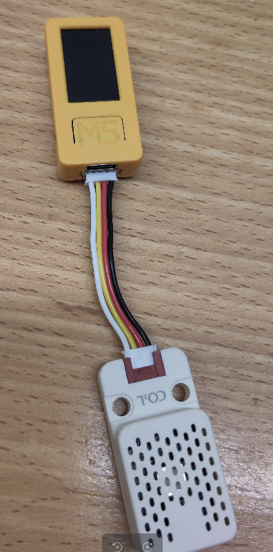
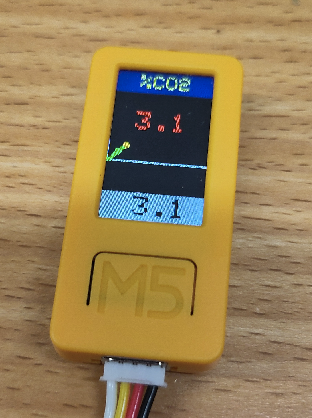
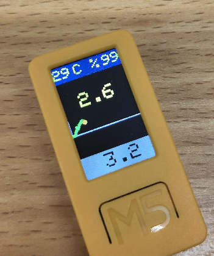
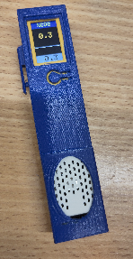

# CO2 sensor for cavers
This project intends to provide cavers with a CO2 sensor that they can build themselves relying on off-the-shelf modules.
It is based on a M5stickCplus2 and a M5 CO2L sensor (SCD41) that can be bought from M5stack.com.

# Disclaimer
This sensor cannot be considered as a safety tool as it is not designed according to regulations, and has not undergone a safety analysis. There is no guarantee about its behavior although it was successfully tested in caves.

## Main features

### Adapted CO2 alert thresholds
Commercial detectors follow regulations that define dangerous CO2 between 0.1% to 0.5%. Most cavers I know go caving at much higher levels. And many caves now exhibit CO2 levels above 0.1%.
The displayed CO2 level color changes according to these levels:
- green: in conformance with strict regulations: < 1000ppm
- orange: between 1% and 3%: you will experience loss of focus, headache, confusion, anxiety: it is time to exit !
- red above 3%: if still rising, this is **life threatening**: give up and exit slowly: a buzzer will sound to remind you about the danger

### Max hold feature
The maximum value is displayed at the bottom. This gives you the capability to descend the detector to the bottom of a pitch and get it back while you are at the top of the pitch, so that you can check the CO2 value at the bottom and decide if it is safe to descend.
Using the front button you can reset this maximum.
**IMPORTANT** the detector must stay for 30s at the bottom as it takes time to get a stabilized value

### Plot
It displays the last 50 measurements which translates into 5 minutes of records. This allows you to check if the measurements were stabilized i(see above).

### Ambiant temperature and humidity
Press button C (on the right side) : this will display the temperature and relative humidity for 2s

# Building your detector

## Prerequisites
Hardware:
- M5Stack M5StickC plus2
- M5Stack CO2L sensor (based on SCD41X)
- There is a proposal for housing as a FreeCAD 3D model that is shaped in such a way that you can put it inside a plumbing PVC hose closed on both ends using PVC removable caps. But you can create your own housing, just take care to protect the detector as much as possible as it was not intended for such a hostile environment. Unfortunately, the sensor must be in contact with the air to measure CO2.

On the software side you will need:
- Arduino IDE 2.3.X
- M5StickCPlus2 library
- M5StickCPlus2 board library

### Build
Hardware assembly is straightforward: you just need to connect the sensor to the display stick

Software code is more challenging because you need to install Arduino IDE 2 on your PC, load the right libraries, then download the project from GitHub as a zip file, expand it, and load the .ino file into your Arduino IDE. 
Connect your display to your PC using a USB C cable.
You will need to choose the target as M5StickPlus2 and select the serial link in the toolbar.
**Note** Your PC might not detect the display: you may need to install a driver. Search the internet for the right solution according to your OS.

Use default Build options, and build (arrow icon in the menu bar)
Once the code has been downloaded it should start working

## Use
- Charge your detector using the USB cable
- Remove the cable, and switch off by pressing the left side button for 5s
When you need to measure the CO2:
- Switch on by pressing the left side button until the display turns on
- It takes 5s to get an update: a flashing dot confirms that the value was updated
- The plot shows the 50 last measurements. After 50 measurements, it will continue to display from the beginning, erasing the oldest measurement. The latest measurement is pointed out by its orange color and bigger dot.
- Maximum recorded value is continuously updated: If you want to reset it, press the front button.
- Switch off after your measurement session as there is only a small battery inside
The detector can run on its battery for about 2h30

# Software architecture
The sensor is abstracted by the class CO2sensGen so that it could be possible to use other sensors.
**NOTE 1** We tried the cheap sensor SGP30 that provided quick measurements, but while it provided sensible measurements near the exhaust pipe of a lawnmower, it did not provide correct measurements in caves (stuck at 0.1%)
**NOTE 2** The SCD40 could also be used and is cheaper, but as it does not support single-shot measurement (only periodic ones), the .ino file will have to be updated along with the CO2sensGen class.

In the .ino file, after initialization, a measurement is requested and we wait until it is complete, which takes about 5s. Then, after a small delay that you can change, a new measurement is requested.
After each measurement, the display is updated and a task is started to temporarily display the flashing dot.
A 200ms cyclic task is used to check for a press on the main button that results in a reset of the maximum value on the bottom of the screen.

# Improvements
Feel free to improve the sensor for yourself or the community by branching.
As for merge requests, I will only consider caver-specific usage (no need to improve the accuracy, as we are outside the SCD41 accurate range most of the time...).
I may not be very responsive as it depends on my current workload.

